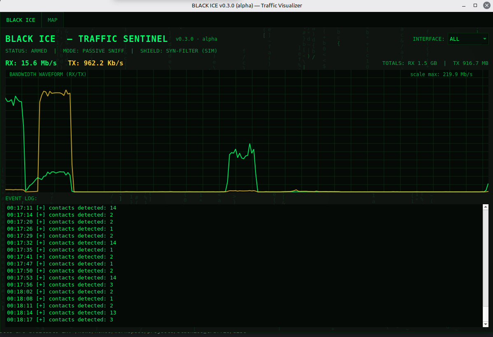
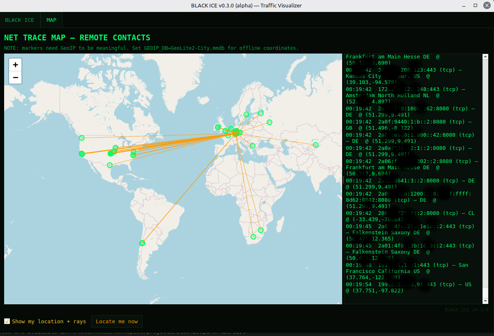

# BLACK ICE - Traffic Visualizer

Minimal hacker‑style network traffic visualizer for Linux, built with **Python + PyQt5**.

Green‑phosphor UI, scanlines, matrix rain, live bandwidth waveform, and a world map
showing your remote connections — with optional **"my location"** marker and rays.


WARNING: this __not__ a hack tool, just a educational project made just 4fun




---
## Features

- Old‑school **BLACK ICE / cyberpunk** interface  :) 
- Live RX/TX bandwidth (per interface or total)  
- Event console (connections discovered in real time)  
- World map (Leaflet via QtWebEngine)  
- Optional **My Location** marker
- **Rays** from you to remote contacts  
- Offline GeoIP support (MaxMind GeoLite2)  
- No packet sniffing by default (psutil‑based, safe mode)
---

## Requirements

- Linux
- Python 3.8+
- PyQt5
- psutil
- PyQtWebEngine (for MAP tab)

Optional:
- `geoip2` + `GeoLite2-City.mmdb` for offline geolocation

---

## Install

```bash
python3 -m venv .venv
source .venv/bin/activate

pip install PyQt5 psutil PyQtWebEngine
# optional offline GeoIP
pip install geoip2
```

If QtWebEngine is missing via pip:

```bash
sudo apt install python3-pyqt5.qtwebengine
```

---

## Run

```bash
python3 blackice_traffic.py
```

With offline GeoIP:

```bash
GEOIP_DB=/path/to/GeoLite2-City.mmdb python3 blackice_traffic.py
```

Building deb package
------------- 

Install required packages:
```
sudo apt-get install git devscripts build-essential lintian upx-ucl
```
Run build:
```
./build_deb.sh
```

Building linux binary (PyInstaller) 
------------- 
Run build:
```
./build_linux_bin.sh
```

---

## Map notes

- Private / loopback / Docker IPs are labeled as **LOCAL**
- Connections without coordinates are not placed on (0,0)
- "My location" is optional and can be toggled in the MAP tab

---

## Disclaimer

This tool is **visualization only**.
It does not block traffic, inject packets, or perform intrusion (not yet).
Use responsibly ;).

---

> BLACK ICE DEFENDER — observe the net.
