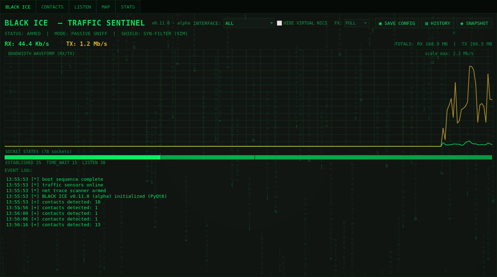
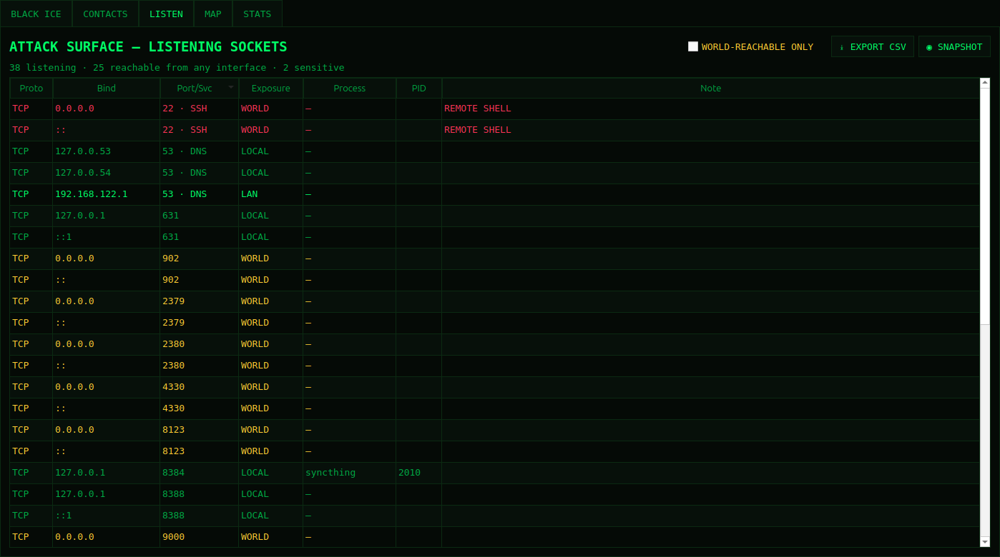
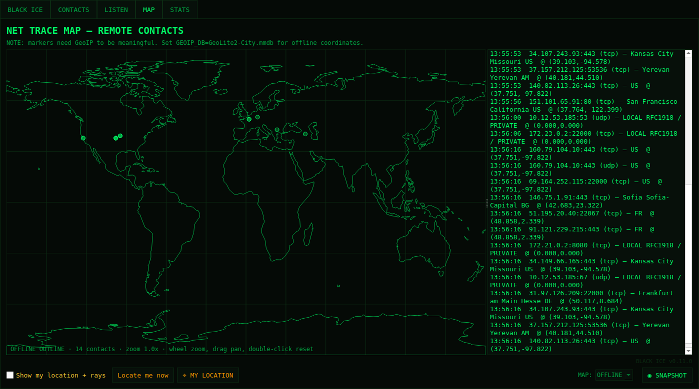

# BLACK ICE - Traffic Visualizer

Minimal hacker‑style network traffic visualizer for Linux, built with **Python + PyQt6**.

Green‑phosphor UI, scanlines, matrix rain, live bandwidth waveform, and a world map
showing your remote connections — with optional **"my location"** marker and rays.


WARNING: this __not__ a hack tool, just a educational project made just 4fun





---
## Features

- Old‑school **BLACK ICE / cyberpunk** interface  :) 
- Live RX/TX bandwidth (per interface or total)  
- **Socket state histogram** — ESTABLISHED / SYN_SENT / TIME_WAIT / CLOSE_WAIT at a glance
- Event console (connections discovered in real time)  
- **CONTACTS tab** — sortable/filterable table of remote endpoints, with connection
  state, reverse‑DNS hostname, watchlist flags, a right‑click menu and CSV/JSON export
- **LISTEN tab** — what this host is *accepting* on: bind address, owning process and
  an exposure class (WORLD / LAN / LOCAL), with sensitive world‑reachable ports called
  out, a *world-reachable only* filter and CSV export
- **World map**, offline by default — a bundled 10 KB coastline outline drawn natively
  (wheel to zoom, drag to pan, double‑click to reset); Leaflet/OpenStreetMap still
  available as an ONLINE mode
- Optional **My Location** marker and **rays** from you to remote contacts
- **⌖ MY LOCATION** button — geolocates you in the background and flies the map to your position
- **STATS tab** — bandwidth history plus top countries, top networks (ASN) and
  top talkers (endpoints per process)
- **Watchlist rules** — your own CIDR / port / ASN / country / process / host rules
  flag matching contacts red and raise an alert banner
- **▤ HISTORY** toggle — optional, off by default: records contacts and bandwidth to a
  local SQLite database so they survive a restart, and marks endpoints never seen
  before as **NEW**
- **HIDE VIRTUAL NICS** — keep docker/veth/bridge/tunnel interfaces out of the totals
- **FX** intensity — OFF / SUBTLE / FULL for the matrix rain and scanlines
- **Snapshot button** on every tab — save the current view as PNG
- **▣ SAVE CONFIG** toggle — optional, off by default: remembers window geometry, open tab and layout between runs
- **Headless mode** — `--headless` scans and exports without a GUI; `--selftest` checks itself
- Offline GeoIP support (MaxMind GeoLite2)  
- No packet sniffing by default (psutil‑based, safe mode)
---

## Requirements

- Linux/Windows*
- Python 3.9+
- PyQt6
- psutil

Optional:
- `PyQt6-WebEngine` — only for the MAP tab's **ONLINE** (Leaflet) mode; the default
  offline map is drawn natively and works without it
- `geoip2` + `GeoLite2-City.mmdb` for offline geolocation
- `GeoLite2-ASN.mmdb` for the ASN/Org column and the TOP NETWORKS rollup

---

## Install

```bash
python3 -m venv .venv
source .venv/bin/activate

pip install PyQt6 psutil
# optional: the ONLINE (Leaflet) map mode
pip install PyQt6-WebEngine
# optional offline GeoIP
pip install geoip2
```

---

## Run

```bash
python3 blackice_traffic.py
```

With offline GeoIP:

```bash
GEOIP_DB=/path/to/GeoLite2-City.mmdb python3 blackice_traffic.py
```

An ASN database is picked up the same way (`ASN_DB=/path/to/GeoLite2-ASN.mmdb`);
without it the ASN/Org column and the TOP NETWORKS rollup stay empty.

## Command line

```bash
python3 blackice_traffic.py --selftest
python3 blackice_traffic.py --headless --duration 60 --export contacts.csv
```

| flag | meaning |
| --- | --- |
| `--headless` | scan without a GUI, print a summary, optionally export |
| `--duration N` | how long `--headless` keeps scanning (default 10s) |
| `--interval N` | seconds between scans (default 3) |
| `--export PATH` | write contacts to PATH — `.json` for JSON, anything else CSV |
| `--resolve` | reverse‑DNS every contact (slower) |
| `--watchlist PATH` | use a different rules file |
| `--selftest` | run internal checks and exit non‑zero on failure |
| `--version` | print the version and exit |

## Watchlist

Rules live in a plain, hand‑editable file next to the config:

```
~/.config/blackice/watchlist.txt
```

One rule per line, `#` starts a comment:

```
cidr      185.220.100.0/22   TOR EXIT RANGE
port      3389               RDP
asn       AS13335            CLOUDFLARE
country   RU
process   nc
host      .example.com
```

Matching contacts turn red, get the rule's label in the **Flags** column, and raise the
alert banner on the BLACK ICE tab. Nothing here is downloaded or updated: a bundled
"known bad" list would be stale the day it shipped and unverifiable offline, so the
rules are yours alone. Press **⚑ RULES** to reload the file after editing it — the
reload is retroactive — or right‑click a contact to append a rule for it.

## History

**▤ HISTORY** is off by default and nothing is written until you turn it on. With it on,
contacts and a once‑a‑minute bandwidth sample are recorded to:

```
~/.local/share/blackice/history.db
```

The addresses already in that database form a baseline, so an endpoint this machine has
never contacted before is flagged **NEW** for the session — private, loopback and
link-local addresses are never flagged, so your own LAN does not drown the signal.
Rows older than 30 days are dropped on startup. Turning the toggle off closes the
database and stops recording.

Building deb package
------------- 

Install required packages:
```
sudo apt-get install git devscripts build-essential lintian upx-ucl
```
Run build:
```
./build_deb.sh
```

Building linux binary (PyInstaller) 
------------- 
Run build:
```
./build_linux_bin.sh
```

Building Windows binary (PyInstaller) 
------------- 
Run build:
```
./build_win.cmd
```

---

## Configuration (optional)

Saving is **off by default** — out of the box the app writes nothing and always
starts from its defaults.

Press **▣ SAVE CONFIG** in the top bar of the BLACK ICE tab to turn it on. From
then on the following is restored on the next launch:

- window geometry and maximized state (re-centered if the saved monitor is gone)
- the selected tab
- the interface picked on the BLACK ICE and STATS tabs, and the STATS time window
- the CONTACTS column widths, sort column/direction and filter text
- the MAP splitter position, map mode and the *Show my location + rays* checkbox
- the FX intensity, the hide-virtual-NICs switch, and the LISTEN tab's filter and
  column widths
- whether history recording was on

State lives in a plain, hand-editable INI file:

```
~/.config/blackice/blackice_traffic.ini
```

Turning the toggle off deletes every stored key (the flag itself stays, so the
app knows not to restore). Deleting the file by hand has the same effect.

---

## Map notes

- **OFFLINE** (the default) draws a bundled Natural Earth 1:110m coastline —
  119 rings, 2505 points, 10 KB in `resources/world.bin` — with no network access at
  all. **ONLINE** loads Leaflet from unpkg and tiles from OpenStreetMap, which does
  reach the internet.
- Private and Docker IPs are labeled as **LOCAL**; loopback contacts are dropped by
  the scanner rather than shown
- Connections without coordinates are not placed on (0,0)
- "My location" is optional and can be toggled in the MAP tab

---

## Tests

```bash
QT_QPA_PLATFORM=offscreen python3 -m unittest discover -s tests
```

## Disclaimer

This tool is **visualization only**.
It does not block traffic, inject packets, or perform intrusion (not yet).
The LISTEN tab reports your own machine's listening sockets; it does not scan anyone.
Use responsibly ;).

---

> BLACK ICE DEFENDER — observe the net.
